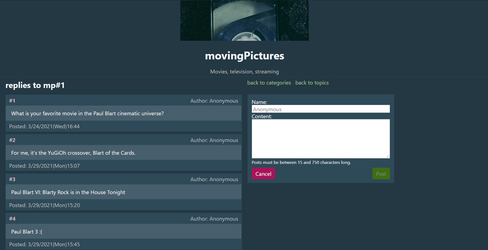

# deltaChannel

This is an anonymous textboard. Users are able to participate in the community and discuss particular topics without the usual barrier of account registration.

## Live Demo

[Try out the live demo of the project.](https://deltachannel.herokuapp.com/)

## Get Started

To run your own local version of deltaChannel, follow the installation instructions below.

1. Make sure you have [node](https://nodejs.org/en/) and [git](https://git-scm.com/downloads) installed.
2. You will also need a [MongoDB Atlas cluster](https://docs.atlas.mongodb.com/getting-started/) to store your local version's posts. You will be connecting to the cluster through a Node.js Driver and you will receive a connection string to use in step 4.
3. Clone the repository with `git clone https://github.com/arnest00/delta-channel.git`.
4. You will need to add an `.env` file to the root directory. Add environment variables `PORT=5000` and `MONGO_URI=mongodb+srv://<username>:<password>@cluster0.99999.mongodb.net/myFirstDatabase?retryWrites=true&w=majority`. Replace the value for `MONGO_URI` with the connection string you received in step 2.
5. Install dependencies with `npm install`.
6. Run the app with `npm run dev`, and open [http://localhost:3000/](http://localhost:3000/) to view it in your browser.

## Built With

  - [Mongoose](https://mongoosejs.com/)
  - [Express](https://expressjs.com/)
  - [React](https://reactjs.org/)
  - [Node.js](https://nodejs.org/)
  - Bootstrapped with [Create React App](https://github.com/facebook/create-react-app)
  - [React Router](https://reactrouter.com/web/guides/quick-start)
  - [Helmet](https://helmetjs.github.io/)
  - [normalize.css](github.com/necolas/normalize.css)